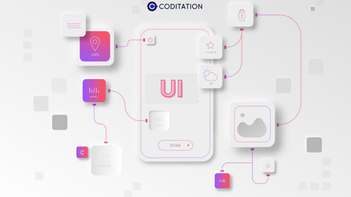
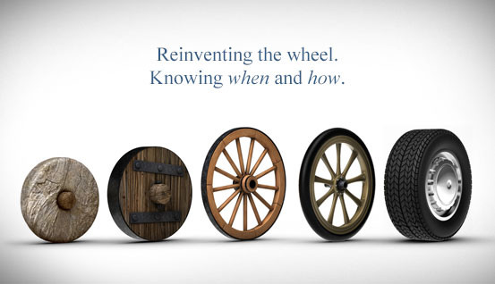
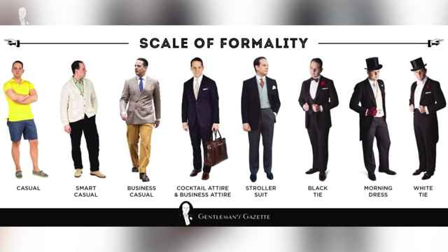

## Time Does not Grow on Trees
Time is money, but unlike money, you cannot gain more time; you can only slow down or speed up how much of it you lose. Everyone, to varying degrees, understands the value of time, often making choices that seem to mitigate waste and maximize the time invested in doing things they enjoy. People will spend years in school to earn certificates that allow them to pursue higher-paying careers, or they will enter the workforce early to gain work experience and climb to higher positions. They do this so that they can live easier lives and afford to spend more time enjoying life rather than simply surviving paycheck to paycheck. This idea of time management exists in every choice made. In the context of web development and internet browsing, similar choices can be analyzed from the standpoints of both the creator and the user. 

## The Internet
The internet has had a profound impact on every aspect of life, making time management easier in some ways and harder in others. Information in all forms can be shared, searched, and modified in near-instant time, enhancing research, education, infrastructure, and innovation. However, the vastness of human knowledge accessible on the internet requires new and creative methods to parse and isolate only the relevant information. Search engines like Google save people time spent scouring and reading every forum and webpage by procedurally curating a list of sites for users to view based on given keywords. 

## A marketplace of information
In recent years, new careers and business opportunities have arisen with the widespread adoption of the internet. In the same way that time has become regarded as a form of currency to be invested, attention and viewership have turned into a currency that can be exchanged for money through traffic onto online storefronts and, most commonly, advertisements. Real viewership requires a certain amount of time investment from the user, which causes websites to operate more like vendor stalls than simple resources; as a result, the landscape of the internet shifts toward a marketplace rather than a library. 
A website that can effectively compete in this marketplace will achieve the goals of its web developers and create an experience that enables visitors to quickly get what they want, whether that is simply information, a purchase request, or a point of contact. One strategy employed by many webpages hosted on the web today is the use of UI frameworks like Bootstrap.

## User Interface Frameworks
UI frameworks help format websites to enable a more appealing, eye-catching, or memorable presentation of information, which can be centered around a brand, place, product, event, person, or organization. Although raw HTML and CSS also allow web developers easy ways to organize and design their sites with various fonts, colors, and media, UI frameworks are freely available and far more robust, capable of achieving comparatively advanced and intricate designs. 
However, as an inherent cost of using these UI frameworks, which were authored by other developers, time and effort must be devoted to learning how defined styles operate and interact to display content on a webpage. Moreover, any updates or changes made to those frameworks prompt developers to fix compatibility issues that arise in their webpages. Despite these setbacks, it remains far more advantageous for web developers to adopt UI frameworks. 
UI frameworks are important for websites on both an aesthetic and a functional level. They increase development speed and enable web design features that produce a better experience for visitors, ultimately resulting in a webpage that effectively achieves its purpose.

## Avoid Reinventing the Wheel
The greatest advantage of using UI frameworks is the time saved by not creating the same features and styles for a webpage that already exist, which were likely made with a higher degree of quality control. Trying to configure a website from scratch by building CSS style classes to make HTML elements responsive and easier to manipulate may produce good results, but the time invested can be costly. That time could have been better spent creating actual content for the site. UI frameworks provide convenience for web developers because websites tend to share common features, such as responsive buttons or links, smooth animations for dropdown menus, or slideshows of pictures on small block elements. 
All of these features can be achieved using the toolkit provided by frameworks like Bootstrap. Bootstrap can be thought of as a library that web developers can integrate into their sites the same way other programming languages (like JavaScript, Python, and C) can link to, import, or include external libraries with functions and classes that other developers designed. Overall, more time is saved in development by learning to use UI frameworks. Beyond just an increase in efficiency, the results possible through Bootstrap contribute greatly to the goals developers want to achieve through their websites.

## Appeal and Visual Identity
In a marketplace, customers may find themselves drowning in choices but operating on a budget too small to visit every stall, so quick judgments must be made. Oftentimes, this involves judging a book by its cover and deciding which stalls appear to be the most appealing, are attracting the most visitors, and seem the most trustworthy. How a storefront or website looks can mean the difference between a window shopper and a real customer or visitor.
In the digital age, websites are often one of—if not the—first places people learn about or interact with a company, business, organization, or brand. Ensuring their webpages give an appropriate and positive first impression is essential. If people are going to judge based on looks, it is imperative to give them as much information as possible through the visual style of the homepage. Using interactive buttons, links, appropriate multimedia, and recognizable color schemes while pursuing a specific aesthetic gives a visitor the impression of quality, professionalism, and reliability. This ultimately keeps them from clicking off to find another site.
The mere appearance of a website can contribute a great deal to how trustworthy the shared information or file is considered, as avid internet users often develop an intuitive radar for deceptive or malicious websites. A sketchy website may appear low-effort, riddled with ads and pop-ups, or have broken links and layouts. For a legitimate storefront, avoiding these red flags that give the impression of a scam website can contribute to greater web traffic and bolster sales.
Beyond simple impressions, a website’s design can help reinforce or establish a brand’s identity to help set it apart from competitors. For companies that rely on their uniqueness or brand recognition, the visual identity of their webpages often reflects signature patterns and color schemes, or invokes a specific aesthetic genre that fits closely with their brand. First impressions formed from a home webpage are very important for any business or brand. However, while the "look" gets people to stay longer, it is the actual "layout" that gets them leaving sooner and returning more often.

## Respecting the visitor’s time
Optimizing a website to make visitors "stay longer and leave sooner" may seem counterintuitive until viewed from the perspective of the person browsing the site. Visitors to a webpage are generally looking for only a few specific bits of information or want to do something simple, like make an appointment, complete a purchase, or send an email. Making it easier for them to accomplish their objectives and move on to the next task creates a better user experience. This, in turn, garners positive impressions and increases the chances of people returning.
On a grander scale, knowledge is everywhere on the internet, and with so much being shared, people have a hard time discerning which articles are important to them. Search engines help users by providing an algorithmically curated list of websites that may interest them based on the keywords they search for. However, within those websites, people still need to parse through information to get to what they really want. Webpages, through the use of UI frameworks, can make this process easier for visitors in a similar way. By organizing information into separate pages, tabs, or panels consolidated under concise labels like “About Us,” “Store,” “Products,” and “Schedule with Us,” users can quickly skim through to get a basic idea of what those links contain, making navigation throughout a website straightforward. Instead of forcing people to read through a long essay, a webpage can divide paragraphs into smaller articles that link to each other through keywords, clear hyperlinks, or tabs on a navigation bar, ensuring less time is spent reading irrelevant material.

Time is money, so reducing the work people must do to understand what they see on a webpage saves them time and makes for a much smoother and satisfying experience. In summary, web developers wielding UI frameworks can create a more effective webpage by building one that respects the user’s time. 

## AI; convenience with a consequence:
With the advent of AI, and especially Google’s AI Overviews, the utility of UI frameworks for webpages diminishes as [fewer and fewer people visit them](https://www.niemanlab.org/2026/03/traffic-to-top-tech-publications-has-plummeted-since-2024-new-analysis-shows/), opting instead to consume similar information in bite-sized summaries of varying accuracy. The conveniences that these frameworks once granted to both web developers and users have been outpaced by the conveniences of AI in the eyes of many. For most sites, viewership and traffic are driven by content, which often consists of writings or articles discussing a variety of topics. With AI summaries extracting that same information and repackaging it into a seemingly adequate alternative, does it matter anymore if developers use UI frameworks when most users will never interact with that interface?

## For the people, by the people
Regardless of the influence AI may have on the internet, websites should continue to be designed with the user experience in mind. There will always be people who look beyond AI overviews and summaries to delve directly into the sources. Alienating those visitors by neglecting effective UI design will only push them toward alternatives like AI. Ultimately, the internet could become a place purely for bots to scrape data, rather than a free and open marketplace for people to share their ideas and knowledge.
AI, like Bootstrap, is a tool that can be wielded in ways that either benefit or harm people. This leaves room for developers to find ways to use AI to enhance their webpages, providing more value to users than any generated summary ever could. The dehumanization of the internet has been a hot topic since well before the rise of AI, dating back to when attention and web traffic became a business and sites began faking engagements with bots. As discouraging as it is to see the internet move in that direction, it becomes all the more important for people to push for content and websites that prioritize the human experience, preserving an internet that was made by people, for people.

---
### AI Usage

Gemini was used to find and fix any capitalization errors, misspellings, and improper grammar. All content was authored by Au Quang.
