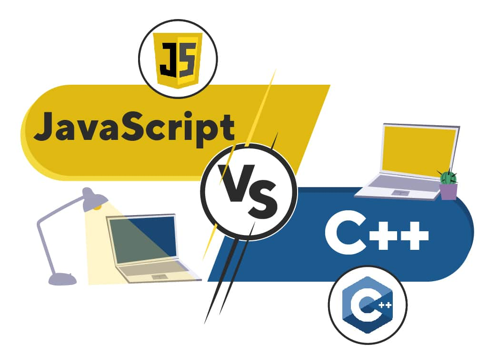
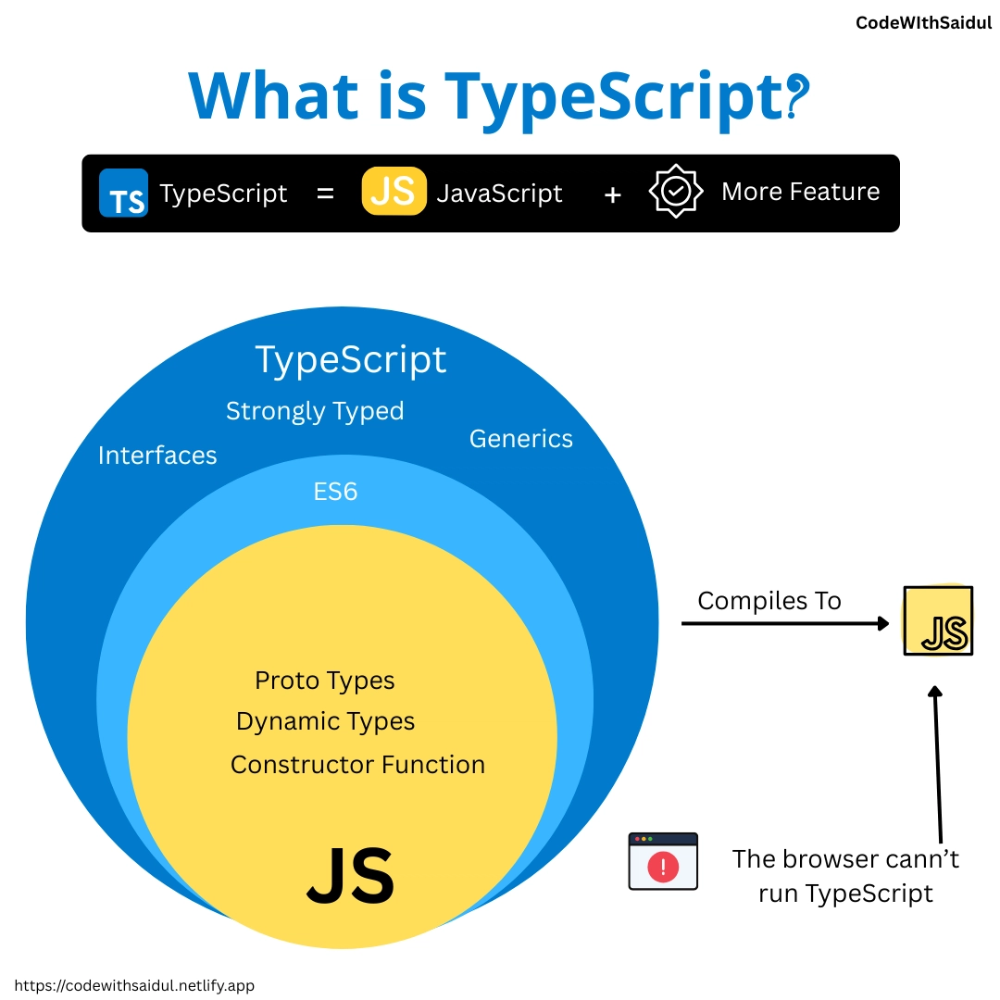

  

## What is the difference between C and JavaScript?

Dynamic languages like JavaScript and Python have always felt more fluid and natural to write for me because they’re as readable as pseudocode. But when it comes to debugging errors and figuring out runtime issues, they can be just as difficult, if not worse, to parse than C or C++. On the other hand, languages like C++ are far more strict with syntax and statically typed variables, which ensures programmers like myself are quickly called out when we accidentally assign a float to a string. TypeScript is effectively just JavaScript with the option to statically type variables, combining these benefits from both languages.

## Do I like it?

While TypeScript is much easier to understand and write, just like JavaScript, my familiarity with the language needs more time to develop. Having recently completed a course where the majority of the coursework was C++, I find myself caught up in old habits like treating objects as pointers. 
As of now, I still feel some friction with the language but I’m certain, as it was the case with C++, that my muscle memory will mold itself to produce TypeScript code with greater ease.

  

## Best Language Ever?

As someone who is more interested in the graphical and optimized aspects of coding, I will always lean towards low-level and compiled languages over interpreted ones simply due to the higher performance. As a student, I much prefer learning about implementing algorithms and designing software architecture through languages that won’t yell at me for forgetting a semicolon. 

It all depends on the purpose being served, and in my case as a student already struggling to keep up with my other courses, I would say that TypeScript feels just as conducive to my learning in ICS as JavaScript or Python have in previous classes. With regards to the athletic programming exercises where time is more restrictive, I’m very thankful to be writing in TypeScript rather than in C or C++.

 
 

<h3>AI Usage</h3>

Gemini was used to find and fix any capitalization errors, misspellings, and improper grammar. All content was authored by Au Quang.
