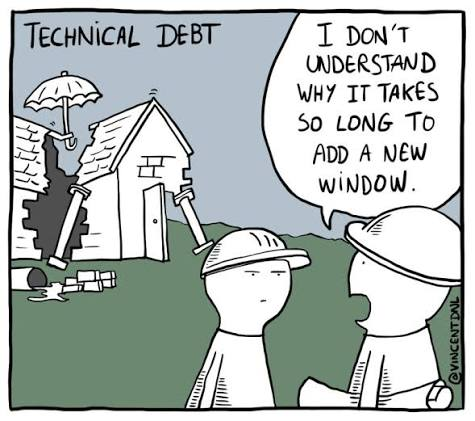
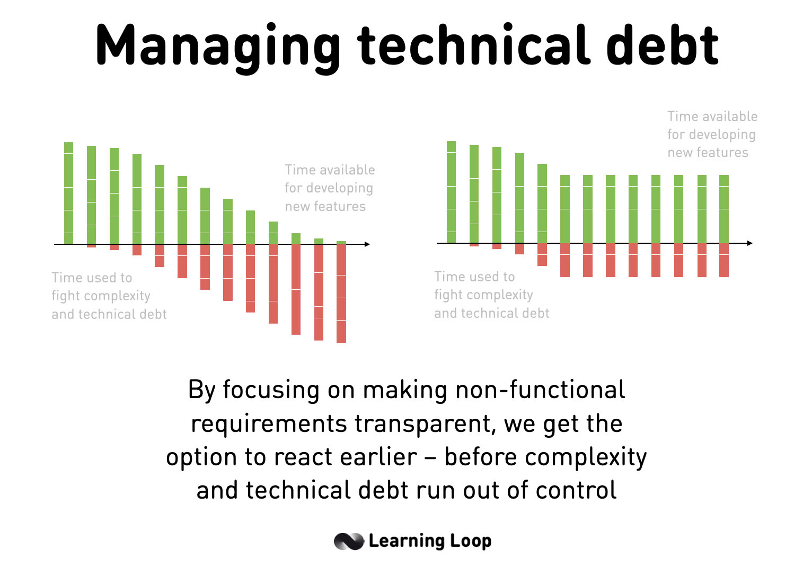
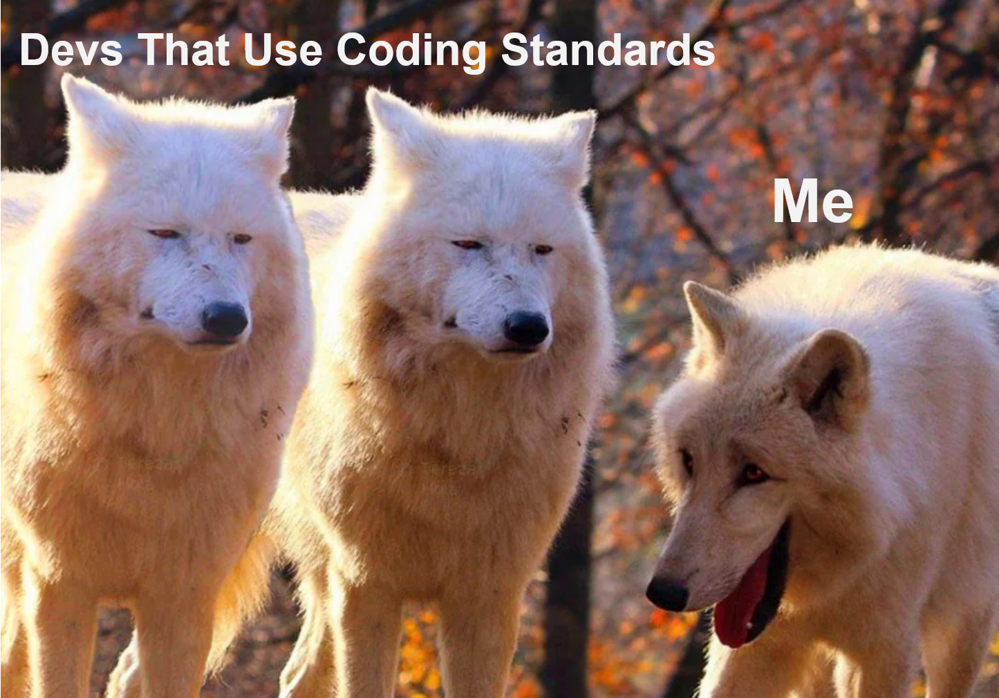

Short Answer: The next guy that has to fix it, and chances are it's going to be the same guy, several days after they’ve already forgotten how it worked.

  

<h1 align="center">What is code</h1>

Software and coding, in the simplest description possible, are a series of instructions that computers follow to produce certain results or to solve various problems. What programmers do is design and package those instructions for other people to be able to easily deploy and use on their own devices. From the user’s standpoint, as long as the software works, it doesn’t really matter how well it was written. 

From the perspective of programmers, this sentiment can also be found, especially when dealing with code written by another programmer from years ago that all other code depends on, but no one on the current development team actually understands what it does or how it works. Consequently, workarounds and temporary fixes end up adding to this problem of [technical debt](https://www.ibm.com/think/topics/technical-debt). This is where coding standards come in as a tool to protect the accessibility of a codebase and enhance not only the development of a project but the experience of the people working on it too.

<h1 align="center">Accessibility</h1>

Modern software and applications often involve dozens to hundreds of people working on their codebases, where collaboration between different teams and departments is required for a successful product. Communication is always a point of friction in any collaboration, but when dealing with code, effective communication starts before developers even need to speak face-to-face. 

Coding standards help ensure every module, class, and function built can be easily parsed by any developer working on the project. This can be achieved by setting guidelines and rules for naming variables, objects, constants, or methods, as well as file organization and error handling. Furthermore, when creating new classes, there can be a set of requirements that need to be met before they can be used by the other scripts in the project, in addition to the coding syntax standards. In a similar vein to writing professional emails, coding standards ensure developers are using proper English rather than slang or pidgin, thereby preventing the need to call on others to explain or translate.

<h1 align="center">Efficiency and Career Development</h1>

  

Effective communication is conducive to the scalability and efficiency of a project. With every developer able to read and understand any script, time and manpower can be directed toward implementing new features, improving performance, and fixing bugs, instead of trying to reverse-engineer existing code or recreating a function that is already buried in old, obfuscated code. This efficiency in communication is especially important for new hires who are just starting to work on the codebase and are expected to implement a new feature on their own, or write a bug report on code that was created at the start of the project several years ago. 

  

With the highly competitive landscape of software engineering and the occasional layoffs, programmers don’t often stay at one company for the duration of their careers; therefore, being able to adapt to a new project quickly is an invaluable skill. Moreover, coding standards can prevent bad practices that often lead to bugs, such as using arrays of ambiguous types or functions that use magic numbers, so that developers spend less time fixing code and more time building it.

<h1 align="center">Lone Wolf Mentality</h1>

  

As someone who has mostly written code for individual projects and personal tools, I have developed my own loose coding standards, which I view as both a benefit and a detriment. For personal projects, having a less restrictive standard for my code enables quicker prototyping and debugging, while still keeping the coding style somewhat uniform throughout a project. However, coming back to that code weeks into the future always requires some extra effort to read through my comments (if I chose to make them) or to walk through what each line does in the specific function I’m working on. Part of the joy in coding is creating a function or class and watching it finally work, which is where my sloppy coding standards optimize the ease with which I write code rather than keeping things neat and easy to fix. These projects will never be shipped to the public, so whatever technical debt is accrued in them may not be directly consequential to my career as a software developer. However, doing so builds bad habits that I may bring into future projects. Such projects will undoubtedly involve other developers, which means those bad habits become their problem as well. 

Despite recognizing all the benefits of having strict coding standards, I believe that in the future, I will most likely continue to write my personal code with little to no restrictions simply due to the ease and speed with which I can produce it. However, I don’t believe that should stop me from breaking bad coding habits when in a more professional setting. In a similar fashion to how I’ve written my notes in classes, depending on whether or not someone else will have to view and understand them, I can be far messier and much more disorganized, using made-up abbreviations and drawings in order to get information down quickly when I don't have the expectation of sharing what I’ve written. Then whenever I did need to share my messy notes, I would spend some time consolidating all the important points, reorganizing, and cleaning everything up for others to be able to comprehend. Similarly with code, I could use one coding style to achieve the “content” then use another to improve the “presentation” of that content.

In a real commercial coding project, I could test and experiment with the functionality of a new feature or algorithm in a separate environment where I am free to code in the manner that is most efficient for me, then once I know that my code works properly, I can translate it to the main project, applying all relevant coding standards.

<h1 align="center">What to do</h1>

  

Though this strategy attempts to allow the use of both styles of coding (standardized and nonstandardized), it is very possible for bad habits to develop that could impact professional projects. In that case, I would be better off using strict coding standards from the start and avoiding the translation altogether. Ultimately, the best method will be one that enables efficiency in the development process and allows me to be the best programmer I can be.

  

Due to my lack of experience with collaborative projects, I am unsure which coding habits will cause problems and need updating to fit the standard. As I gain more experience working with other developers and get more familiar with how they format and write their code, I hope to be flexible enough to adapt to their criteria and contribute as a member of a pack.

Gemini was used to find and fix any capitalization errors, misspellings, and improper grammar. All content was authored by Au Quang.
