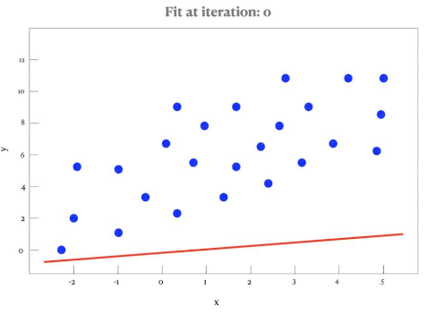

My first coding was a polynomial best fit line generator, where given a csv file of x and y values, our program implemented an algorithm that would calculate the best values of coefficients for a polynomial function to align with the data set given. I remember this project being my first extensive coding project that took me 3 days of constant coding and debugging to complete. 

Serving as my first introduction to coding, ICS 101 was a course that both challenged and invigorated my passion for programming. For a final project, each student was tasked to create a program that would read a set of data from a text file that contained values for points on a 2 dimensional grid and generate a best fit line to represent the trend shown in the given plot.
The algorithm itself was not too difficult to understand, as it required repeatedly iterating over the data to update coefficients in a polynomial function until a low deviation value was reached. 

The challenging part was not designing the program itself but rather troubleshooting the bugs that would arise. I distinctly remember spending hours dealing with an issue where inside of a comparison statement, I had used a single equal sign rather than 2 and all attempts to compile pointed to an error in the previous line, not the line with the actual issue. This was the first time I learned why it was not advised to not spend too much time trying to solve an issue in session and to take breaks to reorganize and tackle the problem with a fresher mind. 

Undertaking this project required me to understand version control by saving the project and duplicating it at significant stages of development, documenting the purpose and significance for saving at those stages in a final report sheet, and allocating my time properly as the time to start and finish the project was during finals week. After devoting more time than was necessary to debug, I was able to submit my project and report on the overall process of developing it by the start of the third day. 

  

