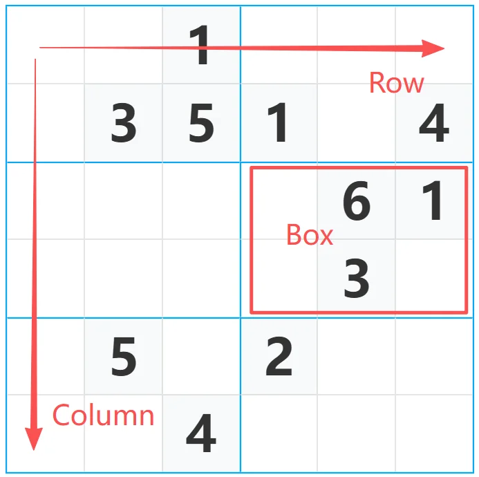
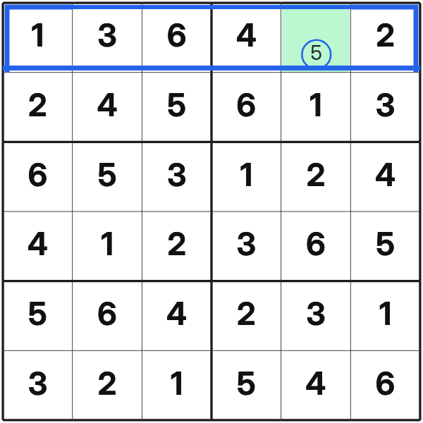

  

    
    
  

While classic Sudoku is 9x9, 6x6 Sudoku plays by the same rule, but with fewer numbers and on a smaller grid. 

Online and in newspapers, one will find countless Sudoku puzzles, most likely with predetermined solutions, however to keep 
  the coding simple, this 6x6 Sudoku project only checked whether a number inputted into a given slot was valid and not if it 
  fit a specific solution. As some who have played before it is possible for a number to adhere to all the rules but result 
  in no solution because it blocks a specific number from another slot.

Using a simple wave function collapse algorithm to determine whether the player places a valid number into an empty slot, 
  my 6x6 Sudoku project would first randomly place a few valid numbers into various slots that would be immutable, and allow 
  the player to explore different solutions to the puzzle with the remaining slots. Due to the random nature of how a puzzle 
  was initialized however, it was possible for it to be unsolvable due to having a valid placement of initial numbers that 
  would block numbers in other slots. For more information on the wave function collapse, this [YouTube video by Coding Quest](https://www.youtube.com/watch?v=qRtrj6Pua2A)
  provides a detailed explanation,

What makes this project interesting besides how it allows that player to change the solution with every choice, is how the 
  entire game would run as its own object that could expose certain properties to communicate with different interfaces. 
  When launching the game, the player could choose to play it through console commands and have the grid printed out using 
  text like ASCII art, or on a more modern graphical interface with a grid of buttons that responded to user mouse 
  and keyboard inputs.
  

